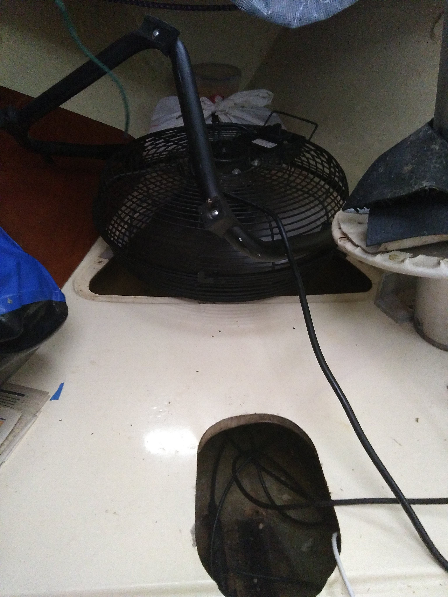

================================================
Tammy Norie Modification and Maintenance Journal
================================================

:Author: Richard Brooksby <rptb1+tammy-norie@pobox.com>
:Date: 2019-11-23

2019-11-23

  Fixed up tent frame.  Several of the joints from the gazebo frame
  had come apart.  Tightened the guy ropes holding things together.
  Pushed water from the sagging parts of the tarpaulin.  TODO: Tape
  joints.

  Sponged water from bilge and bilge in front of the mast, where it
  was very dirty.

  Measured moisture in mast step: still saturated.

  Set up mains fan pointing down into triangle hatch in front of mast,
  blowing air over the mast step and through other bilges to try to
  help drying.

   Fan blowing air around the mast step.

2019-11-24

  Measured foam volumes and took photographs: sides, liner, ceiling,
  under-cockpit, heads-bulkhead, aft-bulkheads, coamings,
  quarter-berth, forward-bulkhead, cockpit-locker.

