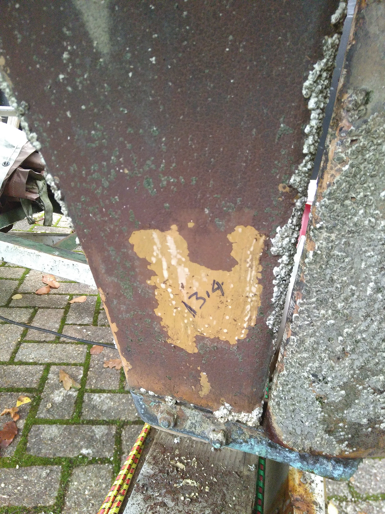

.. -*- mode: rst; coding: utf-8 -*-

===================================
Tammy Norie Osmosis Prevention Plan
===================================

:Tag: plan.osmosis-prevention
:Author: Richard Brooksby <rptb1+tammy-norie@pobox.com>
:Date: 2019-11-25
:Readership: author, boat engineers
:Confidentiality: public
:Copyright: Copyright 2019 Richard Brooksby
:License: `CC BY-NC-SA 4.0`_

.. _CC BY-NC-SA 4.0: http://creativecommons.org/licenses/by-nc-sa/4.0/

1. Introduction
===============

This document explains how and why I intend to protect Tammy Norie's
hull against osmosis.

Almost every other Newbridge Coromandel I have come across has
suffered from osmosis.  It's well-known that polyester resins from a
particular period are susceptible to osmosis [citation required].
It's therefore reasonable to assume that Tammy Norie is susceptible.

Although osmosis is not critical to a boat's safety, it is expensive,
difficult, and time-consuming to treat.  It is also quite easy to
prevent.  It therefore seems like a very good idea to take steps to
prevent it!

I highly recommend reading [Smith-2003]_.  It is the most scientific
and practical description of osmosis and how to prevent or treat it
that I have found.  It is a welcome antidote to the rumours and
superstition surrounding the problem.

2. Goals
========

_`.goal.prevent`

  Make is very unlikely that osmosis blistering will occur in Tammy
  Norie's hull.

_`.goal.repair`

  Repair any damage found to the hull below the waterline.

_`.goal.antifoul`

  Refresh the antifouling on the hull, which hasn't been renewed for
  at least three years.

3. Requirements
===============

_`.req.effective`

  Must be effective.  [TODO: Work out how to quanitify and test this.]

_`.req.time`

  Must be possible in reasonable time [TODO: quanify]

_`.req.cost`

  Must have reasonable cost [TODO: quantify]

_`.req.durable`

  Must last a long time without further maintenance [why?] [TODO: quantify]

_`.req.maintainable`

  The cost of maintenance must be low [TODO: quantify]

4. Design
=========

4.1. Overview
-------------

_`.design.barrier`

  Apply an epoxy-based barrier coat to Tammy Norie's hull below the
  waterline.  Epoxy is much [ref?] less permeable to water than
  polyester, and this should reduce the possibility of the polyester
  resin going into solution and causing blistering and delamination.

_`.design.evaporate`

  Ensure that all internal surfaces of the hull below the waterline
  have adequate air flow for moisture to evaporate faster than it
  penetrates the hull.  This is the basic mechanism by which osmosis
  is prevented in the long term [Smith-2003]_.  However it is in
  conflict with plan.unsinkability.design.displace [RB-2019-11-14]_.

_`.design.dry`

  Dry out Tammy Norie's hull as far as possible to reduce the
  possibility that trapped water will dissolve the resin and cause
  blistering or delamination.

  It's a good idea to do this before `.design.barrier`_ so that drying
  can occur through both the inside and outside of the hull.  Steve
  Smith writes that this “utterly unnecessary” [Smith-2003]_, but is
  assuming rapid evaporation from the interior surface of the hull,
  which may be limited by plan.unsinkability.design.displace
  [RB-2019-11-14]_.

  In any case, the cost of this step is low.  Tammy Norie is out of
  the water for the winter of 2019/2020 in order to implement
  plan.unsinkability and there is no need to implement
  `.design.barrier`_ until early spring.  [TODO: Check epoxy barrier
  coat instructions for timing.]

_`.design.drain`

  Ensure that all internal surfaces of the hull are able to drain to
  the main bilge and dry.

_`.design.drain.under-cockpit`

  Add a drain from the channel under the cockpit to the main bilge so
  that it can dry out.  [ref? picture]

  The bilge is adjacent and the bilge pump pipe passes through, so
  this may just be a matter of enlarging the existing hole with a
  file.

  Also, arrange an air gap between the bilge pump pipe and the channel
  to help with drying.

_`.design.drain.quarter-locker`

  Add a drain from the lowest point of the quarter locker into the
  main bilge so that it can dry out.  [ref? picture]

  This area is adjacent to the channel under the cockpit to the main
  bilge.  The main problem will be cutting a small hole at the level
  of the hull.  This can probably be done with a flexible drill bit,
  but I must take great care not to damage the hull.

  This hole should be small.  The amount of water is small, and if
  there is flooding of the locker the rate of water flow into the
  bilge should be limited.  [TODO: But what about clogging?]

_`.design.drain.forward-triangle`

  Add a drain from the lowest point of the triangular locker in front
  of the mast to the main bilge so that it can dry out.  [ref? picture]

  This will be tricky.  The area is obstructed by the depth sounder
  oil cup, and then the mast step.  There is no obvious route to the
  main bilge unless there is a void under the step.  [TODO:
  Investigate under the mast step with endoscope.]

_`.design.drain.under-berth`

  The locker under the quarter berth has no drain.  This volume does
  not normally accumulate any water, but it is also rarely opened, so
  it would be best if it dried.

  The locker's lowest point is adjacent to the volume under the
  cockpit, which drains to the main bilge, so it should be possible to
  make a small hole.

4.2. Suppliers
--------------

_`.supplier.smith`: Smith & Co. <http://www.smithandcompany.org/>.  Their
web site does not mention any marine products and they may have been
superceded.

5. Plan
=======

_`.plan.lift`

  Lift Tammy Norie out of the water.

_`.plan.clean`

  Clean sea life from the hull to help speed `.design.dry`_.

_`.plan.scrape`

  Scrape off existing antifouling to expose gel coat to the air to
  speed `.design.dry`_.

_`.plan.dry-bilge`

  Manually dry as much of the bilge as possible using absorbtion with
  sponges, paper, and by cleaning away any moisture-retaining dirt.

_`.plan.fan`

  Use a fan to force airflow around the inside of Tammy Norie's hull,
  especially the bilges, to evaporate water from the surface and
  speed `.design.dry`_.

_`.plan.tent`

  Build a tent over Tammy Norie so that she does not get rained on and
  can be opened up to a greater volume of air during the winter.

[TBD]

6. Schedule
===========

_`.schedule.2019-10/11`:

  1. Lift boat.
  2. Scrape barnacles.
  3. Experiment with scraping antifouling.
  4. Take moisture measurements.
  5. Build tent over boat.
  6. Manually dry bilges and hull.
  7. Set up drying fan.
  8. Investigate wet areas in the hull and plan drying.

7. Journal
==========

_`.journal.2019-10-25/27`

  Lifted Tammy Norie and moved to 245.  Cleaning.

_`.journal.2019-11-12`

  Scraped barnacles.  Goodbye my pets.

  Scraped sections of antifouling and found that it came off quite
  easily using a stainless-steel decorating scraper.  I estimate that
  removing all of it will only take a couple of mornings.

  Measured moisture at various points using the moisture meter [ref?]
  and noted it on the hull with a marker pen.

   Scraped area of the rudder skeg with moisture measurement.

_`.journal.2019-11-14`

  Erected tent frame using a jury-rigged gazebo frame and a 10m×10m
  tarpaulin for £60 from eBay [link?] [ref to details in
  [RB-2019-11-14]_].

_`.journal.2019-11-23`

  Fixed up tent frame.  Several of the joints from the gazebo frame
  had come apart.  Tightened the guy ropes holding things together.
  Pushed water from the sagging parts of the tarpaulin.  Made a plan
  to tape the joints together.

  Sponged water from bilge and bilge in front of the mast, where it
  was very dirty.

  Measured moisture in mast step: still saturated.

  Set up mains fan pointing down into triangle hatch in front of mast,
  blowing air over the mast step and through other bilges to try to
  help drying.

.. figure:: IMG_20191123_144436.jpg
   :scale: 20%
   :align: center
   :figwidth: 80%

   Fan blowing air around the mast step.

_`.journal.2019-11-25`

  While measuring the quarter locker
  (plan.unsinkability.journal.2019-11-25) I discovered that the lowest
  point does not drain [picture? IMGA0768.JPG].
  
_`.journal.2019-11-27`

  While building the battery compartment
  (plan.unsinkability.journal.2019-11-27) I discovered that the
  channel along the centre of the volume under the cockpit
  (plan.unsinkability.vol.under-cockpit.channel) is quite wet and
  dirty and does not drain in to the main bilge at its lowest point.
  Some sort of drain needs to be arranged.  In fact, several other
  drains need to be arranged.  Wrote `.design.drain`_ and
  `.design.drain.under-cockpit`_ among others.

A. References
=============

.. [RB-2019-11-14]
   _`plan.unsinkability`: “Tammy Norie Unsinkability Plan”;
   Richard Brooksby;
   2019-11-14;
   <https://github.com/rptb1/tammy-norie/blob/master/plan/unsinkability.rst>.

.. [Smith-2003]
   “The Real Story of Osmosis Blistering: Treatment, Cure and Prevention”;
   Steve Smith;
   Smith & Co.;
   2003-03;
   <http://www.smithandcompany.org/GRP/GRP.html>.

     “I am actually the guy who discovered what was causing gel-coat
     blisters, when the boat manufacturers were denying that there was
     any such thing.”

     “I developed the Barrier Coat Technology in 1975 and hulls
     correctly done since that time have shown no further damage.”

     “If water evaporates off the inner hull surface of a fiberglass
     hull boat faster than it can diffuse through the barrier paint
     coating, this results in a very low moisture content in the
     laminate.”

     “One significant feature of my discoveries in the refurbishment
     of older GRP hulls is that it is utterly unnecessary to dry the
     hull for months with a dehumidifier tent, etc.” [TODO:
     Investigate this further.]

     “Moving air evaporates water faster than anything else, and the
     removal of excess water in the laminate is the key to a more
     successful blister repair, whether one uses the fanciest epoxies
     or the cheapest polyester.  With adequate ventilation most hulls
     are adequately dry in a few weeks...”

.. [SailLife] Link to Mads work on osmosis in Athena's hull [TODO:
              Decide how to link it.]

B. Document History
===================

==========  ====   ============================================================
2019-11-25  RB_    First outline and brainstorm.
==========  ====   ============================================================

.. _RB: mailto:rptb1+tammy-norie@pobox.com
