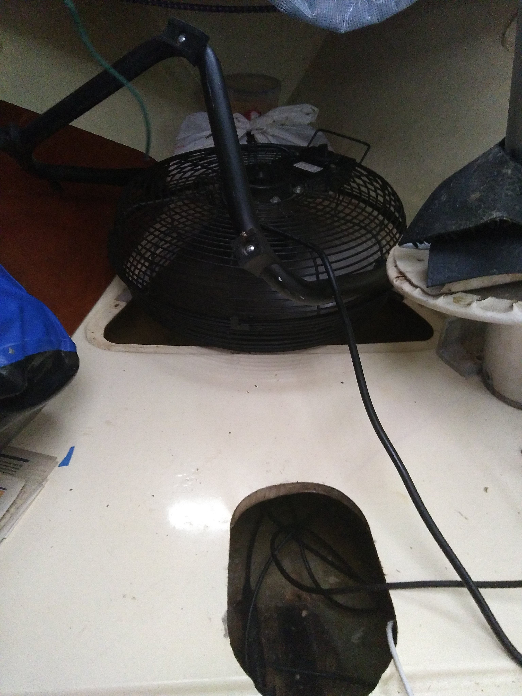

.. -*- coding: utf-8 -*-

===================================
Tammy Norie Osmosis Prevention Plan
===================================

:Author: Richard Brooksby <rptb1+tammy-norie@pobox.com>
:Date: 2019-11-25
:Copyright: `CC BY-NC-SA 4.0`_
:Tag: plan.osmosis-prevention

.. _CC BY-NC-SA 4.0: http://creativecommons.org/licenses/by-nc-sa/4.0/

1. Introduction
===============

This document explains how and why I intend to protect Tammy Norie's
hull against osmosis.

Almost every other Newbridge Coromandel I have come across has
suffered from osmosis.  It's well-known that polyester resins from a
particular period are susceptible to osmosis [citation required].
It's therefore reasonable to assume that Tammy Norie is susceptible.

Although osmosis is not critical to a boat's safety, it is expensive,
difficult, and time-consuming to treat.  It is also quite easy to
prevent.  It therefore seems like a very good idea to take steps to
prevent it!

I highly recommend reading [Smith2003].  It is the most scientific and
practical description of osmosis and how to prevent or treat it that I
have found.  It is a welcome antidote to the rumours and superstition
surrounding the problem.

2. Goals
========

_`.goal.prevent`

  Make is very unlikely that osmosis blistering will occur in Tammy
  Norie's hull.

3. Requirements
===============

_`.req.effective`

_`.req.time`

_`.req.cost`

_`.req.durable`

_`.req.maintainable`

4. Design
=========

4.1. Overview
-------------

_`.design.barrier`: Apply an epoxy-based barrier coat to Tammy Norie's
hull below the waterline.  Epoxy is much [ref?] less permeable to
water than polyester, and this should reduce the possibility of the
polyester resin going into solution and causing blistering and
delamination.

_`.design.dry`: Dry out Tammy Norie's hull as far as possible to
reduce the possibility that trapped water will dissolve the resin and
cause blistering or delamination.  It's a good idea to do this before
`.design.barrier`_ so that drying can occur through both the inside
and outside of the hull.  [NOTE: Conflicts with
`plan.unsinkability.design.displace`_ which will tend to seal off the
interior sides.]

.. _plan.unsinkability.design.displace: unsinkability.html#.design.displace

4.2. Suppliers
--------------

.supplier.smith: <http://www.smithandcompany.org/>.

5. Plan
=======

_`.plan.lift`: Lift Tammy Norie out of the water.

_`.plan.clean`: Clean sea life from the hull to help speed
`.design.dry`_.

_`.plan.scrape`: Scrape off existing antifouling to expose gel coat to
the air to speed `.design.dry`_.

_`.plan.dry-bilge`: Manually dry as much of the bilge as possible
using absorbtion with sponges, paper, and by cleaning away any
moisture-retaining dirt.

_`.plan.fan`: Use a fan to force airflow around the inside of Tammy
Norie's hull, especially the bilges, to evapourate water from the
surface and speed `.design.dry`_.

_`.plan.tent`: Build a tent over Tammy Norie so that she does not get
rained on and can be opened up to a greater volume of air during the
winter.

[TBD]

6. Schedule
===========

_`.schedule.2019-11`:

  1. Lift boat.
  2. Scrape barnacles.
  3. Experiment with scraping antifouling.
  4. Take moisture measurements.
  5. Build tent over boat.
  6. Manually dry bilges and hull.
  7. Set up drying fan.

7. Journal
==========

_`.journal-2019-11-23`

  Fixed up tent frame.  Several of the joints from the gazebo frame
  had come apart.  Tightened the guy ropes holding things together.
  Pushed water from the sagging parts of the tarpaulin.  TODO: Tape
  joints.

  Sponged water from bilge and bilge in front of the mast, where it
  was very dirty.

  Measured moisture in mast step: still saturated.

  Set up mains fan pointing down into triangle hatch in front of mast,
  blowing air over the mast step and through other bilges to try to
  help drying.

   Fan blowing air around the mast step.

A. References
=============

.. [Smith2003] “The Real Story of Osmosis Blistering: Treatment, Cure
   and Prevention”; Steve Smith; Smith & Co.; 2003-03;
   <http://www.smithandcompany.org/GRP/GRP.html>.

     “I am actually the guy who discovered what was causing gel-coat
     blisters, when the boat manufacturers were denying that there was
     any such thing.”

     “I developed the Barrier Coat Technology in 1975 and hulls
     correctly done since that time have shown no further damage.”

     “If water evaporates off the inner hull surface of a fiberglass
     hull boat faster than it can diffuse through the barrier paint
     coating, this results in a very low moisture content in the
     laminate.”

     “One significant feature of my discoveries in the refurbishment
     of older GRP hulls is that it is utterly unnecessary to dry the
     hull for months with a dehumidifier tent, etc.” [TODO:
     Investigate this further.]

     “Moving air evaporates water faster than anything else, and the
     removal of excess water in the laminate is the key to a more
     successful blister repair, whether one uses the fanciest epoxies
     or the cheapest polyester.  With adequate ventilation most hulls
     are adequately dry in a few weeks...”

.. [SailLife] Link to Mads work on osmosis in Athena's hull [TODO:
              Decide how to link it.]

B. Document History
===================

==========  ====   ============================================================
2019-11-25  RB_    First outline and brainstorm.
==========  ====   ============================================================

.. _RB: mailto:rptb1+tammy-norie@pobox.com
