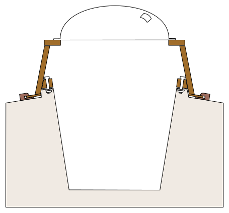

.. -*- mode: rst; coding: utf-8 -*-

==========================
Tammy Norie Ocean Pod Plan
==========================

:Tag: plan.pod
:Author: Richard Brooksby <rptb1+tammy-norie@pobox.com>
:Date: 2019-11-28
:Readership: author, boat engineers, long distance solo sailors
:Confidentiality: public
:Copyright: Copyright 2019 Richard Brooksby
:License: `CC BY-NC-SA 4.0`_

.. _CC BY-NC-SA 4.0: http://creativecommons.org/licenses/by-nc-sa/4.0/

1. Introduction
===============

This document explains how and why I intend to build an observation
pod for Tammy Norie for ocean sailing.

At the moment this document is only an outline, recording the goals,
requirements, and design ideas.  There is no plan or schedule yet.

2. Goals
========

_`.goal.observation`

  Allow observation of the sea around the boat without the need to go
  outside the cabin, reducing the need to put on wet gear and go
  outside to keep a watch when the weather is poor.

_`.goal.comfort`

  Provide a comfortable place to stand or sit while sailing.  Even
  now, I find the nicest place to be on Tammy Norie while sailing is
  standing in the companionway.  This location has easy movement, is
  well braced, comfortable, and allows me to look around the boat.
  However you can't stand there when it's wet or cold, when you're
  forced out into the cockpit.

3. Requirements
===============

_`.req.visibility`

  Provide good 360° visibility to the horizon, even when the boat is
  heeling.

_`.req.warm`

  Keep me warm while looking around in bad weather.

_`.req.dry`

  Keep me dry while looking around in cold weather.

_`.req.quick-scan`

  Enable a quick scan of the horizon for potential collisions in a few
  [how many?] seconds during a sleep interruption.

_`.req.cost`

  Reasonable cost.  [TODO: set budget, clarify]

_`.req.diy`

  Can be built by me.  [TODO: This applies to most projects and is an
  assumption.]

_`.req.maintainable`

  [TODO: clarify]

_`.req.time`

  Can be built by me in reasonable time.  [TODO: clarify]

_`.req.durable`

  [TODO: clarify]

_`.req.strong`

  The pod must endure severe conditions, including:
  - swamping
  - breaking waves
  - knockdown
  - rollover
  - submersion

_`.req.preserve`

  Does not permanently change the fundamental nature of Tammy Norie as
  an example of a well-preserved Newbridge Coromandel in near-original
  condition.  [TODO: This is a duplciate of
  plan.unsinkability.req.preserve, which suggests there should be some
  overall requirements document.]

_`.req.useful`

  Does not significantly limit Tammy Norie's usefulness as a coastal
  cruiser for friends and family, even while it makes her safer as an
  ocean-going passagemaker.  [TODO: This is a duplicate of
  plan.unsinkability.req.useful.]

4. Design
=========

4.1. Ideas
----------

_`.idea.replace-hatch`

  Replace the existing companionway hatch with a pod that fits in the
  same place, without making a permanent modification, so meeting
  `.req.preserve`_.  The idea would be to remove and store the
  existing hatch (possibly ashore) when on a voyage, but keep the
  option of putting it back.  The pod would fit onto the same runners,
  and could ideally slide forward, allowing the companionway to be
  opened to the air.

  Might well be not as strong as the pods of Mingming [ref?] or Betsy
  [ref?] but do not require permanent modification or possibly
  complicated glasswork, helping with `.req.diy`_ and `.req.time`_.

  I'm concerned that a wave hitting the pod (which sticks up much more
  than the existing hatch) could put a lot of strain on the runners
  and be ripped away.  Therefore I want to devise a method of clamping
  the pod into the companionway, effectively fixing it to the deck
  much more strongly.

_`.idea.weatherboard-hatch`

  Replace weatherboards with something fixed containing an ocean
  hatch, so that it's possible to crawl in and out of the cabin when
  the pod is in place.

_`.idea.dome`

  Use a clear observation dome at the top of the pod to provide 360°
  vision, as well as visibility of the rig.

   A vertical section showing how the pod would fit onto the existing companionway.

4.2. Suppliers
--------------

.supplier.port-synthetics: Port Synthetics
<https://portsynthetics.co.uk/acrylic-domes/>, Unit 16 Aston Road,
Waterlooville, Hampshire, PO7 7XG.  Tel +44 23 9266 9788.  Email:
sales@portsynthetics.co.uk

A. References
=============

.. [RT] Roger Taylor's pods for Mingming and Mingming II.  [TODO: Find link.]

.. [GW] Guy Waites' pod for Corribee Betsy.  [TODO: Find link.]

.. [??] Mai  [TODO: Find link.]

.. [??] Havsfidra  [TODO: Find link.]

B. Document History
===================

==========  ====  ============================================================
2019-11-28  RB_   Initial outline from memory.
2019-12-02  RB_   Adding diagram showing how the pod would fit on the companionway.
                  Dug up supplier I found before for the dome.
==========  ====  ============================================================

.. _RB: mailto:rptb1+tammy-norie@pobox.com
