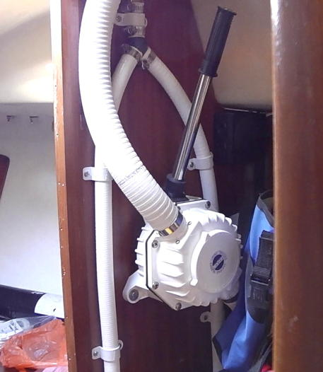
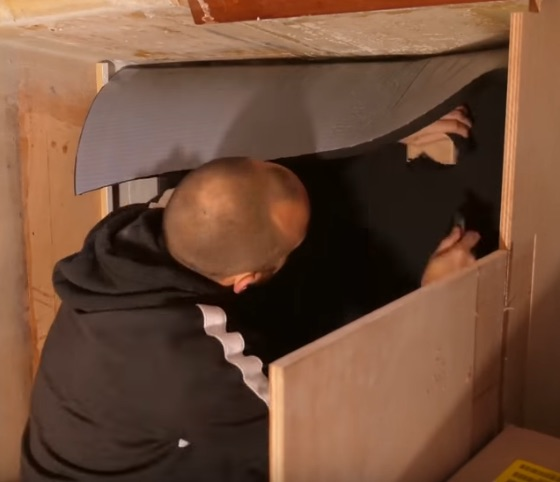
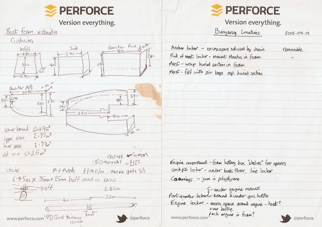
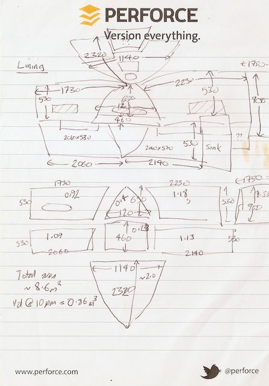

.. -*- mode: rst; coding: utf-8 -*-

==============================
Tammy Norie Unsinkability Plan
==============================

:Tag: plan.unsinkability
:Author: Richard Brooksby <rptb1+tammy-norie@pobox.com>
:Date: 2019-11-14
:Readership: author, boat engineers, long distance solo sailors
:Confidentiality: public
:Copyright: Copyright 2019 Richard Brooksby
:License: `CC BY-NC-SA 4.0`_

.. _CC BY-NC-SA 4.0: http://creativecommons.org/licenses/by-nc-sa/4.0/

1. Introduction
===============

This document explains how and why I intend to make Tammy Norie
unsinkable.

The document uses the conventions of an engineering project at my
company, `Ravenbrook`_, follwing `rule.generic`_ [RB-1998]_.  In
particular:

- It uses tagged statements (with dots) as cross-references
  (rule.generic.ident, rule.generic.once).

- Comment *about* the document that aren't *part* of it are enclosed
  in square brackets (rule.generic.note).  These are often notes of
  things that need further work.

I've included a brief explanation of the purpose of each section so
that you can get the idea.

.. _Ravenbrook: https://www.ravenbrook.com/
.. _`rule.generic`: https://github.com/rptb1/tammy-norie/blob/master/rule/generic.rst

2. Goals
========

_`.goals`: The goals section explains the purposes of the project.

_`.goal.survival`

  Increase chance of survival in the case of a hull
  breach or other catastrophic failure at sea, especially on long
  distance solo passages.

_`.goal.save-boat`

  Reduce chance of loss of boat and all it contains.

_`.goal.benefits`

  Provide other benefits such as insulation, soundproofing, and padding.

3. Requirements
===============

_`.requirements`: The requirements section defines what would achieve
the `.goals`_ in a measurable way, but does *not* presuppose *how* to
achieve them.  They can be used to evaluate whether a design and
implementation are successful.

_`.req.haven`

  Boat remains a safe haven in the case of a hole in the hull which
  can't be fixed for many days.  [Ref to Adrift for 72 days.]

_`.req.chop`

  If you break the boat into pieces, most of them float and some of
  them are liferafts.

  My original spec was that if you cut the boat along any plane, both
  halves float.  The idea of this being that it ensures the buoyancy
  is evenly distributed.  It doesn't quite work for horizontal planes
  though!  Perhaps there is something to retrieve from that.

_`.req.suitable`

  Suitable for Tammy Norie [TODO: clarify -- is this just time and
  cost?].

_`.req.preserve`

  Does not permanently change the fundamental nature of Tammy Norie as
  an example of a well-preserved Newbridge Coromandel in near-original
  condition.

_`.req.useful`

  Does not significantly limit Tammy Norie's usefulness as a coastal
  cruiser for friends and family, even while it makes her safer as an
  ocean-going passagemaker.

_`.req.time`

  Can be fitted by me in reasonable time [TODO: clarify].

_`.req.cost`

  Material costs less than GBP 1000.

_`.req.maintainable`

  Maintainable [TODO: clarify].

_`.req.removable`

  Can be removed and replaced with reasonable cost and effort.  [How
  does this compromise bonding?]

_`.req.access`:

  Must not impair access to equipment or fittings.

  _`.req.access.seacocks`

    Must allow inspection and free access to seacocks in a hurry.
    Must allow for seacocks to be plugged in an emergency.

  _`.req.access.wiring`

    Must allow inspection and maintenance of electrical wiring —
    instrument, radio antenna, and lighting.

  _`.req.access.deck-fittings`

    Must allow access to the fasteners of deck fittings in the
    ceiling.

_`.req.safe`

  Must not introduce other hazards: fire, poison, access, etc.

  _`.req.non-flammable`

    The materials most not readily catch fire or burn or produce toxic
    fumes when burning.

  _`.req.non-toxic`

    The materials must be inert and not be toxic, since I will be
    exposed to them a great deal.

4. Design
=========

_`.design`: The design section explains *how* the `.requirements`_ can
be met to achieve the `.goals`_.

4.1. Overview
-------------

_`.design.displace`

  Attach `closed-cell foam`_ to the hull so that over 1 tonne of
  seawater would be dispalced by the air in the foam even if the boat
  is fully submerged, creating an upthrust greater than the weight of
  the boat [RB-2015-06-09]_ [RT-2007]_.

.. _closed-cell foam: https://en.wikipedia.org/wiki/Foam#Solid_foams

  Newbridge claim the Coromandel weighs 2000lbs (908kg) laden
  [Newbridge-1982]_ and so I'm using this as a guide.  The lack of
  precision in the 2000lb figure suggests an error of at least ±10%.
  I intend to measure the actual weight of Tammy Norie
  (`.plan.weighbridge`_).  Tammy has quite a lot of gear aboard in
  preparation for single-handed distance sailing, so there may be a
  surprise and a need for more floatation.  [TODO: Contingency plan.]

_`.design.lining`

  Most of the foam will be stuck [how?] to the interior of the boat as
  a lining, also providing insulation and padding for comfort
  (`.goal.benefits`_).

_`.design.cushions`

  The interior cushions will also be replaced with closed-cell foam
  cushions, so that they cannot take up water.  These will be strapped
  to the interior so that they do not detach when the boat is flooded
  (`.idea.cushion-straps`_).  THe cushions will be made up of three or
  four layers of the 30mm foam [ref?] that I'm using for lining.  They
  will have a webbing tunnel sandwiched below the top layer, so that a
  webbing strap can be passed through.

_`.design.voids`

  Many accessible unused voids will be filled with foam — particularly
  the `.vol.coamings`_ — but not voids that are needed for drainage or
  access, or voids from which airtight containers can't escape (see
  `.design.containers`_).

_`.design.containers`

  It's not as useful as you might think to fill inaccessible voids
  with closed-cell foam where airtight containers (such as empty
  plastic bottles) will do. As long as they can't escape. Foam is good
  for surfaces.

  Additional precautions include storing as much as possible in
  watertight containers and bags which are half-filled with air.

_`.design.cover`

  The foam will need to be covered with a lining to protect its
  surface and to reflect light, since it is usually matt black.
  Conventional vinyl headlining material is probably the right thing.

4.2. Volumes
------------

_`.vol`: These are the volumes in the boat where closed-cell foam can
be fitted, so that water cannot replace the air and sink the boat.

_`.vol.sides`

  The boat interior sides.  This is the area of the hull that is
  exposed in the boat cabin and forms the "walls".  This could be
  padded quite thickly but it would be nice to keep this fairly thin
  to avoid reducing the living area.

.. figure:: https://live.staticflickr.com/65535/49141335498_12a8527742.jpg
   :width: 500
   :height: 281
   :align: center

   _`figure.side.starboard`: The starboard side of the cabin.

_`.vol.ceiling`

  The boat interior ceiling, mostly comprising the underside of the
  coachroof, but also some of the underside of the foredeck.  This
  will need to be fairly thin to avoid bringing down the ceiling
  height in the accommodation, which is already fairly low.  It must
  also have numerous holes to allow access to the fasteners for deck
  fittings.  It may be possible to make cosmetic plugs for these
  holes.

  The biggest difficulty I anticipate is holding up the ceiling
  lining.  This is a notoriously difficult problem on boats.  Gluing
  tends to be temporary in this context.  My main idea for solving
  this is to epoxy wooden blocks or strips to the ceiling to provide a
  purchase for some sort of screws or other fasteners (see
  `.idea.chesterfield`_).

.. figure:: https://live.staticflickr.com/65535/49142028802_31d481011c.jpg
   :width: 500
   :height: 281
   :align: center

   The cabin ceiling looking forward.

.. figure:: https://live.staticflickr.com/65535/49142029122_152ebf4bff.jpg
   :width: 500
   :height: 281
   :align: center

   The starboard side of the cabin ceiling.

.. figure:: https://live.staticflickr.com/65535/49142029437_c1cda4d892.jpg
   :width: 500
   :height: 281
   :align: center

   The port side of the cabin ceiling.

.. figure:: https://live.staticflickr.com/65535/49141829266_22a9caa85a.jpg
   :width: 500
   :height: 281
   :align: center

   The cabin ceiling looking aft.

.. figure:: https://live.staticflickr.com/65535/49141336848_66ee5aa12d.jpg
   :width: 500
   :height: 281
   :align: center

   The cabin ceiling looking towards the port quarter and the heads
   compartment, above the galley.

.. figure:: https://live.staticflickr.com/65535/49141337058_acf4be967b.jpg
   :width: 500
   :height: 281
   :align: center

   The cabin ceiling looking towards the starboard quarter and the quarter berth.

_`.vol.cushions`

  The existing boat cushions are in good condition even after 36
  years, but they are made of absorbent foam with woven wool covers.
  They would not provide floatation for very long, and in any case
  tend to take up moisture over time.

  Annie Hill warns that closed-cell foam cushions can be uncomfortably
  hard [AH-2015]_.

_`.vol.quarter-berth`

  Although this is part of the cabin it deserves some special
  attention.  The quarter berth runs under the starboard cockpit seat
  and has a wooden bulkhead on the port side adjoining the
  `.vol.under-cockpit`_.  It is a fairly large volume and is my main
  sleeping area.  As such it could be quite thickly lined for both
  comfort and buoyancy.  The berth is also home to clothing and
  equipment bags when I'm not in it.

  [TODO: experiments to see how much space I need for comfortable
  fidgeting while sleeping.]

.. figure:: https://live.staticflickr.com/65535/49141830516_034d219d04.jpg
   :width: 500
   :height: 281
   :align: center

   The quarter berth.

.. figure:: https://live.staticflickr.com/65535/49141831781_d8b2d8f7bb.jpg
   :width: 500
   :height: 281
   :align: center

   The locker under the quarter berth.

_`.vol.coamings`

  The Coromandel has high and broad cockpit coamings that are part of
  the deck mould.  On the starboard side, the coaming forms a large
  void above the `.vol.quarter-berth`_.  (It had a clothes hanging
  rail in when I first got Tammy Norie.)  This void is not very
  useful.  On the port side, the coaming forms a large void above the
  `.vol.cockpit-locker`_.  This is a little bit useful if you can
  stack objects in the locker, but would be no great loss to foam.
  The very aft part of the coamings open in to the
  `.vol.engine-locker`_ and the `.vol.quarter-locker`_.

  The coamings have the advantage that foam can be wedged into them
  quite tightly and is unlikely to come loose.  On the other hand,
  they are quite high above the waterline and so will only provide
  floatation when the boat is very submerged.

.. figure:: https://live.staticflickr.com/65535/49141830806_3e048ea930.jpg
   :width: 281
   :height: 500
   :align: center

   The starboard coaming above the quarter berth.

_`.vol.under-cockpit`

  The Coromandel has a large compartment below the cockpit where an
  internal engine might have been fitted, though I have never come
  across one.  This is extremely useful storage that I use for the
  battery, parts, and tools.  It also contains: two cockpit drain
  seacocks; the hose from the bilge to the bilge pump; the gas alarm;
  the battery shut-off switch and circuit breaker; the electrical
  conduit to the stern.

  A loss of volume in this compartment would be quite hard to bear
  forward, but not so much aft, where the battery is mounted.  This
  part is quite hard to access without crawling, so could not only be
  lined thickly with foam, but could also store containers full of
  air.  It may be possible to form some foam into a mounting for
  various containers, as is done in photographic cases, so that they
  are held firmly.  For example, the tupperware tubs of fasteners,
  electrical parts, etc. could be jammed in effectively.

  _`.vol.under-cockpit.channel`: The bottom of this compartment is a
  channel (with the bilge pump hose in it) that acts as a drain
  forward to the bilge.  It's probably best to leave this exposed.
  [TODO: ref to plan.osmosis-prevention about drying the inside of the
  hull]

.. figure:: https://live.staticflickr.com/65535/49142032162_bbe0e2dfb5.jpg
   :width: 500
   :height: 281
   :align: center

   The volume under the cockpit.

_`.vol.engine-locker`

  The starboard quarter locker holds the outboard engine, which
  protrudes through a hole in to the water.  The lower part of this
  locker is normally flooded, and much more of it floods when the boat
  is heeling.  The locker also holds the main fuel tank on its forward
  shelf.

  The locker has a lot of unused volume.  The upper parts could be
  lined to at least 100mm without restricting airflow around the
  engine, and possibly much more.  The locker lid could also be lined
  with thin foam.  This has the extra advantage of helping to reduce
  engine noise, especially when cruising with the locker closed.

  Foam could also help to wedge the fuel tank more securely in the
  locker.  When sailing, the locker does flood quite deeply and the
  fuel tank is sometimes afloat.

  Conditions in this locker are quite harsh and the foam's backing
  adhesive may not be enough to hold it in place.  It may be possible
  to epoxy wooden blocks to the bulkheads and screw the foam in place
  using large washers.

  [TODO: Try a small section with glue in spring 2020?]

.. figure:: https://live.staticflickr.com/65535/49141832801_9ab8a64ea8.jpg
   :width: 281
   :height: 500
   :align: center

   The engine locker.

.. figure:: https://live.staticflickr.com/65535/49142033207_23d6c47924.jpg
   :width: 500
   :height: 281
   :align: center

   The starboard (hull) side of the engine locker.

.. figure:: https://live.staticflickr.com/65535/49142033437_b7ce2137bc.jpg
   :width: 500
   :height: 281
   :align: center

   The port side of the engine locker.

.. figure:: https://live.staticflickr.com/65535/49142033602_5ffde80865.jpg
   :width: 500
   :height: 281
   :align: center

   The fuel tank in place in the engine locker.

_`.vol.quarter-locker`

  The port quarter locker is a large storage volume.  It also holds
  the gas bottle and the body of the bilge pump.  The electrical
  connections from the cabin protrude into this locker through a tight
  hole.  The bottom of the locker accesses a kind of tunnel that
  awkwardly reaches the engine mounting bolts.  This tunnel should not
  be blocked, but could hold removable airtight containers.  In any
  case, it would be very hard to line with foam.

  Currently I use this locked for a 50 litre spare water container,
  the spare fuel tank, the inflatable dinghy, and various flammable
  engine-related materials such as oil and carburettor cleaner, as
  well as spare butane for the soldering iron.  It also houses the
  bilge pump handles, the hand pump, a drain unblocking water jet,
  funnel and tubing, and a few other gas- or fuel- related items.

  Loss of volume here could be a little tricky as the dinghy fits
  quite snugly with the 50 litre spare water.  Some experimentation
  will be required.

  The aft part of this locker joins with part of the `.vol.coamings`_.

.. figure:: https://live.staticflickr.com/65535/49142034022_af2a3428b8.jpg
   :width: 500
   :height: 281
   :align: center

   The quarter locker.

.. figure:: https://live.staticflickr.com/65535/49141834131_f034412df1.jpg
   :width: 500
   :height: 281
   :align: center

   The quarter locker looking at the rudder post tube.

.. figure:: https://live.staticflickr.com/65535/49142034332_de5e9d8b15.jpg
   :width: 500
   :height: 281
   :align: center

   The port (hull) side of the quarter locker.

.. figure:: https://live.staticflickr.com/65535/49142034567_e36dc786b0.jpg
   :width: 500
   :height: 281
   :align: center

   The starboard side of the quarter locker.

.. figure:: https://live.staticflickr.com/65535/49141834811_7989b4b003.jpg
   :width: 500
   :height: 281
   :align: center

   The aft (transom) side of the quarter locker.

.. figure:: https://live.staticflickr.com/65535/49141833616_e3cc2c7ced.jpg
   :width: 500
   :height: 281
   :align: center

   The tunnel from the quarter locker beneath the engine locker.

_`.vol.cockpit-locker`

  The port-side seat of the cockpit lifts to provide access to a large
  locker that is the equivalent of the quarter berth on the starboard
  side.  This locker also contains the heads seacocks, and the copper
  gas pipe passes through it, attached to the starboard bulkhead.  At
  the forward bottom there is access to a void underneath the heads
  compartment sole.  It also adjoins most of the port
  `.vol.coamings`_.  The locker is used to store a large amount of
  equipment that might be needed while sailing: ropes, bucket, flares,
  kedge anchor, fenders, etc.

  Although this locker often appears full, tidying it always makes it
  half empty, and it could be lined with quite thick foam.  More foam
  might be used to make mountings for various items, so that they
  wedge in tightly.  Access to the seacocks and plumbing must be
  maintained, but in fact could be improved by defending the seacocks
  with foam recesses.  The base of this locker must drain forward
  under the heads compartment sole and in to the main bilge, so it is
  in some sense "inside" the boat.  The drainage channel should remain
  clear.  It may also make sense to stuff spare foam in sheets under
  the heads compartment sole, but there is not a great deal of volume
  there.

.. figure:: https://live.staticflickr.com/65535/49141832246_cc5fc48615.jpg
   :width: 500
   :height: 281
   :align: center

   The cockpit locker looking forward.

.. figure:: https://live.staticflickr.com/65535/49141832521_610ef9f497.jpg
   :width: 500
   :height: 281
   :align: center

   The cockpit locker looking aft.

_`.vol.interior-lockers`

  The Coromandel has a fibreglass liner that forms most of the
  interior bunks.  There is a void on both sides of the boat beneath
  these bunks, with access through locker lids.  The void joins with
  the area under the forward V-berth, which houses the mast step and a
  large triangular area forward of the mast.

  On Tammy Norie, the starboard void contains the flexible 200 litre
  water tank.  Thie does not actually inflate to contain 200 litres,
  but fills the available space.  Lining the void with foam would
  reduce water capacity.

  The port void is used for food storage.  It is a little awkward to
  reach, and food is contained within sealed tupperware containers
  that are thrust into the void and pulled out as needed.  This void
  could be lined, at the cost of loss of stowage.

  The mast step is a wet area that also houses food storage
  containers.  It is moderately hard to access.  On the starboard
  side, near the mast step, is the through-hull fitting for the log,
  and a seacock for the sink drain.  Both of these could benefit from
  protection by foam recesses.

  The forward triangle locker is also used for food storage.  It is
  quite accessible through a large lid and could be effectively lined.

  It may be difficult and unnecessary to attach the foam very firmly
  to the hull or liner in these voids, since it is very unlikely to
  escape in the case of flooding.

  - In the case of the mast step, which is made of wood that tends to
    get wet, it is probably best to allow air circulation and
    encourage evaporation as much as possible.  Certainly it's
    necessary to inspect the step regularly.

  - In the case of the interior lockers, it is probably best to allow
    air circulation and encourage evaporation in order to prevent
    osmosis (plan.osmosis-prevention.design.evaporate)
    [RB-2019-11-25]_.  [TODO: What about other areas below the
    waterline, such as in the lockers?]

  See also compartmentalization of interior lockers task [ref?].

.. figure:: https://live.staticflickr.com/65535/49141338303_94323a3e6a.jpg
   :width: 500
   :height: 281
   :align: center

   The mast step in the volume beneath the liner.  In the foreground
   is the depth sounder oil pot.  In the top left is the log
   paddlewheel through-hull fitting.

.. figure:: https://live.staticflickr.com/65535/49141831331_f6dc18e75b.jpg
   :width: 500
   :height: 281
   :align: center

   The starboard locker beneath the liner.  (Photo not horizontal!)

.. figure:: https://live.staticflickr.com/65535/49141831561_caca24a71b.jpg
   :width: 500
   :height: 281
   :align: center

   The port locker benath the liner.  (Photo no horizontal!)  On the
   right is the log paddlewheel through-hull fitting.  The blue object
   is the flexible water tank.

_`.vol.forward-bulkhead`

  The bulkhead between the cabin and the anchor locker located in the
  bow.

  On Mingming and Mingming 2, Roger Taylor added a second “watertight
  bulkhead” or “collision bulkhead” with foam between it and the
  anchor locker [RT-2007]_.  This could work on Tammy Norie, except it
  would considerably reduce the size of the forward bunks and make it
  much less easy to have guests on board, and so does not satisfy
  `.req.useful`_ or `.req.preserve`_.  [TODO: Ask Roger about this.]

_`.vol.starboard-aft-bulkhead`

  The small bulkhead between the cabin and the cockpit that is
  currently used to mount some equipment.

  [TODO: compromise between current use and foam]

.. figure:: https://live.staticflickr.com/65535/49154448528_de929c32bf.jpg
   :width: 500
   :height: 281
   :align: center

   The starbard aft bulkhead, above the quarter berth.

_`.vol.port-aft-bulkhead`

  The small bulkhead between the heads compartment and the cockpit on
  which the compass, log, and depth instruments are mounted.

  [TODO: describe how access to instruments and wiring will be
  retained]

_`.vol.anchor-locker`

  [TODO: consider if it is sensible to use this at all, reference to
  Roger Taylor's collision bulkhead modification]

_`.vol.heads-bulkhead`

  The forward bulkhead of heads is a large blank wall that could
  easily be covered to a depth of 20-30mm.

    
4.3. Dimensions
---------------

_`.dim`

  These are the approximate dimensions of the `.vol`_ based on
  measurements made on 2019-11-23/25 (`.dim.notes`_).  The purpose of
  this table is to estimate total displacement volume.  In many cases
  geometrical approximations have been used (such as averaging the
  ends of a trapezium) so this table should not be used to order
  sections of foam.  [TODO: Consider the weight of the foam. Current
  estimate is about 15kg.]

Volumes table
.............

_`.dim.table`: ‘Cov’ indicates an area to be covered by vinyl
headlining (`.design.cover`_).

================================  ==========  =======  ========  =======  ================
Reference                          Areas/cm²  Cov/cm²  Depth/cm  Vol/cm³  Note
================================  ==========  =======  ========  =======  ================
`.vol.anchor-locker`_
`.vol.ceiling`_ forward                45×85     3825         3    11475  [TODO: windows]
`.vol.ceiling`_ starboard             50×232    11600         3    38400  [TODO: windows]
`.vol.ceiling`_ port                  50×160     8000         3    24000  [TODO: windows]
`.vol.ceiling`_ top                  100×200    20000         2    26000  inc. hatches
`.vol.ceiling`_ heads top              32×70     2240         2     4480
`.vol.ceiling`_ heads port             48×70     3360         3    10080  minus shelf
`.vol.coamings`_ starboard            36×135                 20    97200  use bottles?
`.vol.coamings`_ port                 36×114                 20    82080  use bottles?
`.vol.cockpit-locker`_ hull          107×114                  3    36594
`.vol.cockpit-locker`_ forward         74×40                  3     8880
`.vol.cockpit-locker`_ aft             56×52                  3     8736
`.vol.cockpit-locker`_ starboard      52×114                  3    17784
`.vol.cockpit-locker`_ lid             33×84                  3     8316  tapered volume
`.vol.cushions`_ port f f             36×120                 10    43200
`.vol.cushions`_ port f a              48×70                 10    33600
`.vol.cushions`_ starboard f f        36×120                 10    43200
`.vol.cushions`_ starboard f a         48×70                 10    33600
`.vol.cushions`_ starboard q a        53×110                 10    58300
`.vol.cushions`_ starboard s           55×40                 10    22000
`.vol.cushions`_ starboard q f         66×82                 10    54120
`.vol.cushions`_ infill                53×54                 10    28620
`.vol.engine-locker`_ lid              44×63                  3     8316
`.vol.engine-locker`_ port             40×35                  3     4200
`.vol.engine-locker`_ hull             43×64                  3     8256
`.vol.engine-locker`_ coaming          15×46                 18    13248
`.vol.engine-locker`_ fuel tank        32×17                 20    10880  [#fueltank]_
`.vol.engine-locker`_ transom         ¼π×46²                  3     4983  quarter circle
`.vol.forward-bulkhead`_             ½×78×62     2170         3     7254  triangle
`.vol.heads-bulkhead`_ lower          ¼π×78²     4776         3    14327  quarter circle
`.vol.heads-bulkhead`_ upper          ¼π×57²     2550         3     7651  quarter circle
`.vol.interior-lockers`_                                                  use containers
`.vol.port-aft-bulkhead`_              58×43     2494         3     7482
`.vol.quarter-berth`_ hull            50×195     9750         3    29250
`.vol.quarter-berth`_ ceiling         42×133     5586         3    16758
`.vol.quarter-berth`_ bulkhead u      32×115     3680         3    11040
`.vol.quarter-berth`_ bulkhead l      17×115     1955        12    23460  cuboid recess
`.vol.quarter-berth`_ locker          55×115                  1     6325  eighth spheroid
`.vol.quarter-locker`_ hull            89×86                  3    22962
`.vol.quarter-locker`_ coaming         14×96                 18    24192
`.vol.quarter-locker`_ lid             44×63                  3     8316
`.vol.quarter-locker`_ starboard       36×74                  3     7992
`.vol.quarter-locker`_ transom        ¼π×30²                  3     2119  quarter circle
`.vol.quarter-locker`_ forward        ¼π×80²                  3    15072  quarter circle
`.vol.sides`_ port                    48×205     9840         3    29520
`.vol.sides`_ starboard               48×214    10272         3    30816
`.vol.sides`_ heads                    44×98     4312         3    12936
`.vol.starboard-aft-bulkhead`_         58×43     2494         3     7482  [#sab]_
`.vol.under-cockpit`_ top             37×107                  3    11877
`.vol.under-cockpit`_ starboard       31×107                  3     9951
`.vol.under-cockpit`_ port            31×107                  3     9951
`.vol.under-cockpit`_ hull            37×107                  3    11877  [#vuch]_
Total                                          108604            1069068  ± 10%
================================  ==========  =======  ========  =======  ================

.. [#fueltank] cuboid blocks to wedge in the fuel tank

.. [#sab] The `.vol.starboard-aft-bulkhead`_ may have to be thinner to
          accommodate the equipment mounts, but it's quite a small
          volume anyway.

.. [#vuch] Might be a good idea to leave this exposed [why?].
       
.. Volume (+ 11475 38400 24000 26000 4480 10080 97200 82080 36594 8880
   8736 17784 8316 43200 33600 43200 33600 58300 22000 54120 28620
   8316 4200 8256 13248 10880 4983 7254 14327 7651 12936 7482 29250
   16758 11040 23460 6235 22962 24192 8316 7992 2119 15072 29520 30816
   7482 11877 9951 9951 11877)

.. Area (+ 3825 11600 8000 20000 2240 3360 2170 4476 2550 2494 9750
   5586 3680 1955 9840 10272 4312 2494)

Contingency
...........

================================  ==========  ======  =========================
Reference                          Areas      Depth   Volume / cm³
================================  ==========  ======  =========================
`.idea.fixed-cushions`_ liner f     11500cm²    20mm   23000
`.idea.fixed-cushions`_ liner s     136×56cm    20mm   15232
Total                                                  38000 ± 10%
================================  ==========  ======  =========================

.. (+ 23000 15232)

Measurement notes
.................

_`.dim.notes`: Here are scans of the notes I made while measuring the
volumes in the boat.  Many of these were scribbled while my body was
bent into awkwards shapes.

.. figure:: https://live.staticflickr.com/65535/49142343657_a0e7a18407_z.jpg
   :width: 449
   :height: 640
   :align: center

   _`.dim.notes.1`: Foam Voids measurement notes page 1/4

.. figure:: https://live.staticflickr.com/65535/49142343917_a7ecd98766_z.jpg
   :width: 453
   :height: 640
   :align: center

   _`.dim.notes.2`: Foam Voids measurement notes page 2/4

.. figure:: https://live.staticflickr.com/65535/49141651928_5a609f1e40_z.jpg
   :width: 453
   :height: 640
   :align: center

   _`.dim.notes.3`: Foam Voids measurement notes page 3/4

.. figure:: https://live.staticflickr.com/65535/49142145621_c351070406_z.jpg
   :width: 453
   :height: 640
   :align: center

   _`.dim.notes.4`: Foam Voids measurement notes page 4/4

4.4. Ideas
----------

_`.idea.cushion-straps`

  Cushions could be made with webbing straps that attach to webbing
  bridges on the cabin liner.  (Adopted into `.design.cushions`_.)

_`.idea.fixed-cushions`

  What if the cabin liner has a layer of foam glued to the top in
  addition to cushions.  The cushions could be more conventional,
  possibly solving Annie Hill's objection [AH-2015]_.

.. figure:: https://live.staticflickr.com/65535/49141337323_51385f3797.jpg
   :width: 500
   :height: 281
   :align: center

   The benches formed by the cabin liner, looking forward.

.. figure:: https://live.staticflickr.com/65535/49141337548_2a4e18df62.jpg
   :width: 500
   :height: 281
   :align: center

   The bench formed by the cabin locker, looking aft towards the quarter berth.

_`.idea.fewer-cushions`

  Since I'm remaking cushions and storing the originals, what cushions
  do I actually need?

_`.idea.chesterfield`

  Some kind of fasteners to tighten the surface lining against the
  foam “stuffing” and so produce an attractive effect like a
  Chesterfield sofa, as well as securing the foam.  The fasteners
  would need to flexible and not have sharp edges, especially on the
  ceiling.  Probably needs prototyping.

  Something like <https://www.ebay.co.uk/itm/UPHOLSTERY-BUTTONS-WIRE-LOOP-BACK-LENGTH-OF-TWINE-12-X-NO45-WHITE-VINYL-COVERED/152515686888?hash=item2382a4b1e8:g:otAAAOSwevlaDG~z>?

_`.idea.pad-eyes`

  How does this interact with the idea of strapping in bags etc. using
  pad eyes attached to the hull in the manner of mini transat racers?

_`.idea.test`

  Test the unsinkability of the boat by attempting to sink the boat.
  This would only be a partial test.

  It would probably be best to do it in clean fresh water, to reduce
  the effort of drying and cleaning up afterwards.  Warm dry weather
  would be good for the same reason.  Sea water is 2-4% denser than
  fresh [#wolfram]_, so displacing it is more effective, and a test in
  fresh water is more rigorous.

  It would also be sensble to do it somewhere that the boat can be
  recovered in some reasonably cheap way if she does *not* float.  For
  example, somewhere that she'll rest on the bottom with her
  coach-roof at the surface, so that we can deploy air bags to
  re-float her, or somewhere that can be drained or a crane can be
  used.

  In addition to being a test of the design, this would be fun and
  interesting and make for an interesting article, photos, and a
  video!

.. [#wolfram] Wolfram Alpha query: `(density of sea water) / (density of fresh water)`_

.. _`(density of sea water) / (density of fresh water)`: https://www.wolframalpha.com/input/?i=%28density+of+sea+water%29+%2F+%28density+of+fresh+water%29

_`.idea.foam-in-bags`

  This is an excellent idea from Bernie Branfield:

    “I carry a can of builders foam and a couple of heavy duty bags as
    part of my emergency kit. So far I have only used them to make a
    cockpit seat!” — `Facebook comment, 2019-11-26`_

.. _`Facebook comment, 2019-11-26`: https://www.facebook.com/permalink.php?story_fbid=2479882315602365&id=1435460230044584&comment_id=2479999215590675&reply_comment_id=2480072452250018

  This is a great way to generate extra flotation while at sea, and,
  as Bernie points out, for fabricating shaped objects.  I think I
  will add this to my kit as well.

4.5. Suppliers
--------------

_`.supplier.capricorn-canvas`: Capricorn Canvas
<https://en-gb.facebook.com/capricorncanvas/>, Stone Pier Yard, Shore
Road, Warsash, Hampshire, SO31 9FR.  Tel: +44 7765 650017.

_`.supplier.c-and-j`: C & J Marine Ltd <https://www.cjmarine.co.uk/>,
Clay Lane, Chichester, West Sussex, PO19 3JG.  Tel: 01243 785485.
Email: sales@cjmarine.co.uk.

_`.supplier.kayospruce`: Kayospruce <https://www.kayospruce.com/>, 2
Cockerell Close, Segensworth West, Fareham, Hampshire, PO15 5SR.
Tel: +44 1489 581696.  Fax: +44 1489 573489.  Email:
sales@sailcloth.co.uk.

_`.supplier.livedale`: Livedale Foam and Sundries
<http://www.livedale.co.uk/>, Unit D Enterprise Court, Seaman Way,
Ince, Wigan, Lancashire, WN2 2AG.  Tel: 01942 825144.  Fax:
01942 825523.

_`.supplier.lux`: _`Lux Distribution`
<https://www.luxdistributionltd.co.uk/>, Unit 3 Watling Court, Attleborough
Fields Ind Estate, Nuneaton, Warwickshire, England, CV11 6GX.  Tel:
02477 670370, Mob: 07476 064038.

_`.supplier.veolia`: Veolia Otterbourne, Poles Lane, Otterbourne,
SO21 2EA <https://goo.gl/maps/D8Fi8ZKhJ8ih2SyB7>.  Tel: 01962 764000.

5. Plan
=======

_`.plan`: The plan section contains a list of concrete steps that I
plan to take to implement the design.  Each step should have a fairly
predictable duration.  Note that the plan section does not say when
things will happen (see `.schedule`_).  The plan is only roughly in
order, but all steps are written after steps they require.

_`.plan.plan`

  Initial plan and schedule.

_`.plan.clear-out`

  Clear out enough stuff from the boat to get access to the surfaces
  and volumes.

_`.plan.measure`

  Measure boat for materials and to ensure that there is enough volume
  to `.design.displace`_ enough volume.

_`.plan.battery`

  Make battery compartment using 1m²×30mm foam sample that I already
  have from `.supplier.lux`_ in order to learn about handling the
  foam, its adhesion, etc.  (And of course to mount the battery!)

_`.plan.find-vinyl`

  Find vinyl headlining offcuts in crates I have at home, prior to
  `.plan.try-chesterfield`_.

_`.plan.find-fasteners`

  Investigate suitable fasteners for `.idea.chesterfield`_.

_`.plan.try-chesterfield`

  Experiment with `.idea.chesterfield`_ with foam sample and vinyl on
  backing board.

_`.plan.strip-deck`

  Remove deck fittings to allow core to dry. [Ref details for this
  project.]

_`.plan.order-mats`

  Order first batch of materials.

_`.plan.surface-prep`

  Prepare surfaces according to the experience from `.plan.battery`_.

_`.plan.initial`

  [Describe initial trial.]

_`.plan.inspect-initial`

  Inspect the initial installation at intervals and check:

  1. bonding between the foam and:
     - rough fibreglass (e.g. `.vol.ceiling`_)
     - gelcoated fibreglass (e.g. (`.vol.sides`_ in the heads)
     - painted wood (e.g. `.vol.heads-bulkhead`_)
     - wet areas (e.g. `.vol.engine-locker`_)
     - gravity-challenged areas (e.g. `.vol.ceiling`_)

  2. bonding between the foam and the vinyl in similar areas

  3. bonding in taped edges

  3. moisture

     - on the surface of the vinyl
     - between the vinyl and the foam
     - between the foam and the surfaces
     - along edges, especially where taped

  4. mould growth
     
_`.plan.weighbridge`

  Visit a public weighbridge with the boat on her trailer (all
  equipment laoded) before launch, then again with just the trailer
  after launch, in order to find out the real weight and required
  volume of floatation.  Compare to actual volume and make further
  plans as necessary.  This can't happen until launch in Spring 2020.
  There is a weighbridge at `.supplier.veolia`_.

_`.plan.more`

  Plan further steps.

6. Schedule
===========

_`.schedule`: The schedule describes *when* things from `.plan`_ are
scheduled to occur.  It is subject to continuous change in the light
of what actually occurs (see `.journal`_).

I'm quite limited with scheduling since I am disabled with `ME/CFS`_,
which is not only both physically and mentally debilitating, but
unpredictable.  In many ways this schedule will be an exercise in
managing my effort carefully to see what I can achieve.

.. _`ME/CFS`: https://en.wikipedia.org/wiki/ME/CFS

_`.schedule.2019-11-17` : Planning (at 1TR)

    Initial plan and schedule (`.plan.plan`_).  Allot time to the
    project on my calendar.

_`.schedule.2019-11-24/28` : Design and measurement (at 245)

    1. Clear out boat (`.plan.clear-out`_)
    2. Measure volumes (`.plan.measure`_)
    3. Make battery compartment (`.plan.battery`_)
    4. Order fasteners for chesterfield (`.plan.try-chesterfield`_)

_`.schedule.2019-12-03/06` : (at 1TR)

    1. Select initial volumes
    2. Order initial materials (`.plan.order-mats`_)

_`.schedule.2019-12-12/17` : (at 245)

    1. Remove deck fittings (`.plan.strip-deck`_)

_`.schedule.2020-01-07/17` : (at 245)

    1. Fit foam to initial volumes.

    [More to be decided]

_`.schedule.2020-02/03` : (at 245)

    1. Weigh and launch (`.plan.weighbridge`_)
    2. Plan to add even more floatation if required [TODO: link to
       contingency plan]

7. Journal
==========

_`.journal`: The journal describes *what* actually occurred and *when*
while implementing the plan.

_`.journal.2019-11-14`

  After refining my big to-do list for the Tammy Norie project, I
  realised that the unsinkability project was too complicated to
  manage with a simple to-do list and decided to write a document.
  That turned into “Tammy Norie Unsinkability Plan” (this document)
  which rapidly grew to a length and level of detail that surprised
  me.  I have been thinking about this project for many years and have
  accumulated a lot of ideas.  On top of that, when I started thinking
  about the volumes inside the boat I realised that there were a lot
  of wrinkles and that writing them up would help a great deal with
  execution and increase the chance of completing the project during
  the winter of 2019/2020.

  As part of a general plan for the winter I constructed a tent around
  Tammy Norie in my parents' driveway using a 10×10m clear tarpaulin
  on a frame jury-rigged from Dad's party gazebo.  This will allow me
  to disgorge the contents of Tammy Norie onto the deck without them
  getting wet during the winter.  It will also help with two other
  projects:

  1. Drying out the hull in preparation for a layer of epoxy to
     prevent osmosis [RB-2019-11-25]_.

  2. Removing the deck fittings, many of which are held in by
     self-tapping screws, and drying out the deck core before
     replacing them using machine screws and nuts, to prevent deck
     core rot [Pascoe-2000]_.  [ref? Mads]

_`.journal.2019-11-24`

  Measured foam volumes and took photographs for `.vol.sides`_, liner,
  `.vol.ceiling`_, `.vol.under-cockpit`_, `.vol.heads-bulkhead`_,
  `.vol.starboard-aft-bulkhead`_, `.vol.port-aft-bulkhead`_,
  `.vol.coamings`_, `.vol.quarter-berth`_, `.vol.forward-bulkhead`_,
  `.vol.cockpit-locker`_.  [TODO: Scan results.]

  Extensive updates to this document including preparation for
  publishing via GitHub so that it can be critiqued by interested
  folks from the `Tammy Norie blog`_, the `JRA forums`_, mailing
  lists, etc.

.. _JRA forums: https://junkrigassociation.org/technical_forum

  At this stage the volumes do not seem to be reaching anywhere near
  my estimate from [RB-2015-06-09]_ so something is wrong and I must
  investigate.  This might just be due to tiredness and `ME/CFS`_
  brain fog.  I will:

  1. Try to rediscover the basis for my estimate.

  2. Re-draw my measurement diagrams more carefully and check my
     current calculations.

_`.journal.2019-11-25`

  Finished measuring volumes (except `.vol.anchor-locker`_, which is
  an unlikey one).  These need writing up in this document, and the
  whole lot need to be gone over more carefully.  I've had a horrible
  thought — did I accidentally make my original esimate using 10cm of
  foam instead of 10mm?

_`.journal.2019-11-26`

  NB writes:

    “I’ve calculated that 10mm of foam on all the surfaces I’ve just
    painted, plus the cushions, add up to about 1m³” suggests that you
    painted nearly 100m². That's a lot. (In comparison: all the walls
    in my living room add up to about 35m².)

  This confirms my suspicions of `.journal.2019-11-26`_ that my
  original esimate was wrong, and that I'll have to find more surfaces
  and voids than I mentioned in [RB-2015-06-09]_.  This is also confirmed
  by the calculations in § `4.3. Dimensions`_.

  I've reached 1m³ by adding the remaining measured volumes and
  thickening the foam on `.vol.ceiling`_.  This demonstrates
  feasibility at least!

  I think `.vol.sides`_ could be thicker instead to avoid reducing
  headroom.

  There are also voids that could be filled with air bottles that are
  not accounted for.  It's probably more efficient to fill the
  coamings with air bottles instead of foam, since they do not need to
  be insulated or padded.  At this stage it's probably worth reviewing
  all the volumes to see what could be replaced by air bottles.

  There is other floatation that is not accounted for: the mast is
  partially filled with bubble-wrap [RB-2015-09-02]_ and the deck is a
  balsa sandwich.  [TODO: Write these up.]

  Published links to this and other plans on GitHub_ and the `Tammy
  Norie blog`_ [RB-2019-11-26]_.

.. _GitHub: https://github.com/rptb1/tammy-norie

_`.journal.2019-11-27`

  Made battery compartment (`.plan.battery`_) but did not stick it in
  place.  Discoveries:

    1. You can draw plans on the paper backing of the foam in pencil.

    2. The foam is easy to cut with scissors.  It can be cut with a
       knife, but even blunt scissors do a better job.

    3. The foam is good at staying in place when it is jammed in by
       its edges.

    4. `.vol.under-cockpit.channel`_ is quite wet and dirty,
       especially forward at the lower end.  It does not drain in to
       the main bilge at its lowest point, and so is accumulating
       water and dirt.  [TODO: Make an action to improve this with a
       limber hole.]

    5. Working in a 25×30cm dark space where you can't bend your
       elbows is quite challenging.

    6. Smooth plastic surfaces (such as the battery case) do not slide
       over the foam surface at all easily.  In fact, the non-slip
       mats used for crockery have a similar feel.  This may be useful
       when using `.design.containers`_ in combination with the foam.

.. figure:: https://live.staticflickr.com/65535/49142469797_9b0f0ca53e.jpg
   :width: 500
   :height: 281
   :align: center

   The battery mount before making a compartment with closed-cell
   foam.

.. figure:: https://live.staticflickr.com/65535/49142269826_30073b9c46.jpg
   :width: 500
   :height: 281
   :align: center

   The volume in which the battery compartment will be made.  The
   large pipe is for the bilge pump.  The small pipe is for the
   auxiliary bilge pump.  The grey cable is for the battery terminals.
   The white conduit carries wiring from the switch panel to the
   stern.

.. figure:: https://live.staticflickr.com/65535/49142270261_2fe8cc7acb.jpg
   :width: 500
   :height: 281
   :align: center

   The battery compartment foam.  The foam is not bonded to the boat,
   allowing access for maintenance (`.req.access`_).

.. figure:: https://live.staticflickr.com/65535/49142270071_469c928099.jpg
   :width: 500
   :height: 281
   :align: center

   The battery mounted in the foam compartment.  The battery moves
   slightly in the compliant foam, but it's not going anywhere.

    I stuck an offcut of the foam to a rough part of the ceiling using
    its own adhesive in order to test the bond.  I deliberately did
    not prepare or clean the surface first.  I'll check the bonding in
    a couple of weeks.  I'll also try to remove it to check
    `.req.removable`_.

_`.journal.2019-11-28`

  Telephoned `.supplier.lux`_ for advice about bonding headlining
  material to the upper surface of the foam.  They recommended spray
  adhesive such as the usual 3M adhesive used for attaching
  headlining.  They also gave me some tips on making best use of the
  self-adhesive layer already on the foam:

    1. Avoid stretching the foam so that it does not creep.

    2. Be careful to avoid air bubbles.  This may be an issue around
       the mounting blocks glued to the sides of the hull.

  Searched eBay for headlining material and found `perforated cream
  vinyl`_ from `.supplier.livedale`_.  I called them for a sample and
  asked about the adhesive they offer with their eBay listings.  They
  said it is their own brand of spray adhesive and that it would be
  good for attaching the headlining to the foam.  I asked what area
  each tin covered and they were not able to say right away, but that
  the tins were 500ml each.  I'll compare this to 3M's tin size and
  perhaps ask again by mail.

.. _perforated cream vinyl: https://www.ebay.co.uk/itm/Perforated-vinyl-Faux-Leather-Headlining-Black-Grey-white-Cream-54-wide/172005169267

  Note that I want material that does not have a “scrim” backing,
  because it will have a very thick foam backing, and the scrim can
  only make bonding more difficult.

  Also ordered a sample of `“marine” headlining`_ from
  `.supplier.c-and-j`_ although all their headlinings look very
  blue-grey on my screen and they didn't answer the phone.  The brand
  name and colour selection also suggests that they are just reselling
  `.supplier.kayospruce`_ material.

.. _`“marine” headlining`: https://www.ebay.co.uk/itm/Upholstery-Lining-Vinyl-Faux-Leather-Finish-Various-Colours-137cm-Wide/123635832619

  Also called `.supplier.kayospruce`_ who will sell me 1.37m×1m of the
  same Nautilex material for GBP 11.90 + VAT, unbacked.  They
  recommended their Kayobond STAB general purpose aerosol for sticking
  it to foam (they have a different product for sticking the backed
  material to a hull).  It comes in 500ml can that will cover 6-8m² at
  a price of GBP 6.24 + VAT per can.  They were excellent on the
  phone.  They are local.  They're sending me a sample book.

  Expanded the volumes table to include a column for the area to cover
  with headlining, giving a total of approximately 11m².  This is not
  yet planned carefully for cutting from the headlining roll, but
  gives an estimate of cost.  Assuming about 30% loss from cutting, I
  might require 11m of lining material, at a cost of GBP 150
  (inc. VAT) from `.supplier.kayospruce`_.  On top of that, two tins
  of spray glue will cost GBP 15.

.. cost calculation (* (/ (* 11 1.3) (* 1.37 1)) 11.90 1.2)

  While I'm calculating costs, it seems like the bulk of the foam will
  be made up of 30mm sections, which comes in `1m×4m rolls`_ for GBP
  66.70 each.  To fill 1m³ will require approximately 8.4 rolls, so
  that's GBP 555.  Although there will be losses due to cutting, all
  the offcuts can be stuffed into voids aboard the boat, so they will
  still be contributing to unsinkability.

.. cost calculation (* (/ 1 (* 4 0.03)) 66.70)
.. _`1m×4m rolls`: https://www.carinsulation.co.uk/product/30mm-closed-cell-foam-car-van-sound-deadening-thermal-insulation

  I will also investigate some of the specialist `.supplier.lux`_
  products for lining engine compartments, etc.

  That puts material cost at about GBP 715 so far, well within
  `.req.cost`_.  However that does not include cushion upholstery.

  Thinking about an incremental plan in order to select initial
  volumes.  I may not be physically able to do as much as I'd like to
  due to disability, so I should focus on what brings the biggest
  benefit first.  I doubt that I'll be making any ocean crossings in
  2020, but I would like the boat to be more comfortable and
  well-insulated.  So it would make sense to concentrate on the cabin
  first.

  I'm going to give this some thought and so have not yet an order for
  the initial materials.  I'm deferring this to
  `.schedule.2019-12-03/06`_.

  I removed some of the deck fittings but it turned out to be a longer
  job than I expected.  Many of the fasteners have not moved
  since 1983.  Also, I'm tired out and have to watch my health.  So I
  decided to defer this task to `.schedule.2019-12-12/17`_.

_`.journal.2019-11-29`

  I explained some of this plan to my friend Richard Kistruck over
  breakfast.  He has some very useful comments:

  1. Once the boat is insulated the amount of condensation appearing
     on the remaining cold spots is likely to increase: the hatch, the
     windows, metal frames, etc.  Perhaps this is another good reason
     (apart from plan.osmosis-prevention) not to insulate below the
     waterline: cold surfaces in the bilge will act as a dehumidifier.

  2. His experience with building an extension suggests that moist air
     will creep through any joints and gaps in the foam and then
     moisture will pool against the hull, causing multiple problems:
     damaging the glue holding he foam to the hull, making osmosis
     worse, generally making the boat hard to dry.  This suggests
     taping over joints.  [TODO: plan taping over joints]

  3. Where condensation accumulates above the foam, such as on the
     windows, it will run down and pool on the upper surface.  This
     suggests taping in an S-shape profile against the hull, top edge
     of the foam, and inner edge of the foam (possibly over the vinyl)
     so that water is guided over the inside of the vinyl.  There it
     can evaporate or be sponged away.  On top of this, space for a
     catch tray that can optionally hold soemthing absorbent might be
     good.

  Thinking about this later, is this an argument *for* or *against*
  perforated vinyl headlining?

_`.journal.2019-11-30`

  I explained some of this plan to my friend Aaron Croucher over tea.
  He asked some sensible questions about the scenario in which the
  foam is keeping you alive.  I said that I imagined the boat could
  still *mostly* sink, and that I might be in the cabin mostly full of
  water, but with a significant air pocket, protected from the
  elements outside while a storm passed.  The main immediate risks
  would be drowning, exhaustion, and thirst.  Once the weather
  subsides it might be possible to patch up the boat and start pumping
  or bailing out water.

  Then it occurred to me that if the boat is nearly completely
  submerged, where can you pump out water *to*?  It's no good bailing
  out water from a submerged cockpit, for example.  You might be able
  to pump water out from the cabin (having fixed a hole) if you can
  get the weatherboards in and create a good-enough seal to get ahead
  with the bilge pump, but that would be tricky.

  Clearly, you really want the cockpit coamings to be above the
  waterline.  Then you can use something as simple as a bucket to get
  water out of the boat and start to raise her up.  This puts even
  greater emphasis on buoyancy in `.vol.coamings`_.  If Tammy Norie is
  mostly submerged, it's better that she is bow-down and cockpit-up.

  Imagining this scenario also reinforces my idea to fit a secondary
  manual bilge pump *inside* the cabin.  On my friends' boat Auriga,
  they fitted a `Lavac toilet`_, which was pumped out by a large pump
  mounted quite high up [RB-2014-07-08]_.  They had a Y-valve on
  this pump with a length of flying hose.  A pump in a similar
  position would make a lot of sense, with or without the head.

.. _Lavac toilet: https://blakesandtaylors.co.uk/popular-toilet-272-p.asp

   Auriga's heads / auxilliary bilge pump

_`.journal.2019-12-01`

  I started a thread, `Lining with closed-cell foam for floatation,
  insulation, and safety`_, in the `JRA forums`_, asking for feedback
  on this plan.  I will need to return to review this conversation.

_`Lining with closed-cell foam for floatation, insulation, and safety`: https://junkrigassociation.org/technical_forum/8148577

_`.journal.2019-12-03`

  There are other plans that interact with this one that need to be
  considered:

  1. Does the hull-deck joint need reinforcing?  It would be a shame
     to have to peel off the foam to do this.  But even if I decide
     not, it would make sense to position a joint between foam sheets
     on the joint, possibly with some sort of gap to allow inspection
     annually.

_`.journal.2019-12-06`

  I would like to have a way to lash down bags in the cabin.  Tammy
  Norie has some wooden blocks glued to the hull, visible in
  `figure.side.starboard`_.  There is also a wooden strip just above
  the joint of the liner with the hull, also visible in
  `figure.side.starboard`_.  These might be able to accept folding pad
  eyes that could be used to lash down bags.

  So I think I will cut a hole in the foam for each block initially,
  so that it is accessible through the foam.  Then possibly a layer of
  thin foam can be added in the hole separately. The vinyl will be
  added on top, without a hole, and the pad eyes screwed through the
  vinyl into the block.  This should lead to the pad eye being
  recessed so that it is out of the way.  It has a secondary effect of
  helping to secure the foam to the hull, in a similar manner to
  `.idea.chesterfield`_.

  I found a video of Mads Dahlke (Sail Life) putting up a similar
  closed-cell foam named Armaflex XG [Dahlke-2019]_.  He discusses the
  pros and cons of foams and has selected 32mm foam for insulating his
  boat, Athena.  You can see him cutting out squares for mounting
  blocks.

   Mads Dahlke (Sail Life) fitting closed-cell foam to Athena.

_`.journal.2019-12-07`

  Selecting initial volumes in order to order initial materials
  (`.plan.order-mats`_).  Initially I plan to insulate Tammy Norie and
  make her comfortable, so the focus will be on the visible areas that
  will be covered with vinyl.  The obvious places to start are
  `.vol.sides`_ and `.vol.ceiling`_, followed by `.vol.quarter-berth`_.

  The 30mm foam is available in `1m×4m rolls`_.  Conveniently,
  `.vol.sides`_, the 30mm areas for `.vol.ceiling`_, and all exposed
  parts of `.vol.quarter-berth`_ are 50cm wide or a little less, and
  will come nicely out of a 1m wide roll.

..   (+ 85 232 160 205 214 133 195)

.. ceiling starboard + side port (+ 232 205)

.. ceiling port + side starboard (+ 160 214)

.. _`1m×4m rolls`: https://www.carinsulation.co.uk/product/30mm-closed-cell-foam-car-van-sound-deadening-thermal-insulation

  I've become concerned about the bonding between the foam and the
  hull. The interior surfaces of the hull are quite rough, being
  exposed fibreglass with no gelcoat.  I'm concerned that the foam
  will only bond to the high spots, making the bond weak, and that
  this will leave voids that might fill with moisture.  Does the
  surface need filling before starting?

  https://youtu.be/6-DfBIgthbg?t=94 using CascoFlex_ “It's recommended
  for use aboard boats for putting up insulation.”  He warns that it's
  hard to use outside the specified temperature range, specified as
  18°C minimum in the `CascoFlex datasheet`_, so it could be hard to
  apply in the winter.  For non-absorbent surfaces (closed-cell foam
  to fibreglass could count) the datasheet recommends initial filling:
  
    “Prime/fill the surface for improved adhesion and a better
    result. If this is not possiblePrime/fill the surface for improved
    adhesion and a better result. If this is not possible, it is
    important to let the water in the adhesive evaporate as much as
    possible before laying the carpet/mat and smoothing/rolling the
    surface.”

.. _CascoFlex: https://www.casco.eu/global/casco/?pc=106&p=756
.. _CascoFlex datasheet: https://media-pms2.schoenox.net/casco/docs/cascoflex_eu_en_tds.pdf

  It may be that a “crack-bridging waterproofing membrane” such as
  AquaStop_ would be suitable.  I would probably need to talk to
  technical experts at Casco.  I note that they are a part of the
  `Sika Group`_, who also make the famous Sikaflex 291 found all over
  boats everywhere.

.. _AquaStop: https://www.casco.eu/global/casco/?pc=108&p=768
.. _Sika Group: https://www.sika.com/

  I think, though, that I will first try the foam with just its own
  adhesive.  I must plan to test and inspect the results, and if it
  fails I can look at better bonding.  For this purpose I have added
  `.plan.inspect-initial`_.

_`.journal.2019-12-09`

  Ordered three off 1m×4m×30mm closed-cell foam from `.supplier.lux`_
  at a cost of GBP 200.10.  Ordered a folding pad eye from YouBoat in
  Gosport via eBay at a cost of GBP 6.49.  That's 0.36m³ so far.

  Scanned original measurements from 2015.  [TODO: Compare these with
  current measurements.]

   Original boat cushion measurements and list of buoyancy locations
   from 2015.

   Original lining measurements from 2015.

_`.journal.2019-12-16`

  Unfortunately health has slowed me down during
  `.schedule.2019-12-12/17`_ and I have not been able to fit any foam.
  This has not been helped by the collapse of the tent covering Tammy
  Norie on 2019-12-13.  Also, I've realized that more preparation is
  required before I can fit foam:

  - I probably need to bond some wood to the hull to provide
    attachment for straps just above the liner.

  - I need to figure out how to support the foam in the coamings above
    the quarter berth.

  However, I did have some successes:

  1. The sample of "ivory" coloured vinyl from `.supplier.kayospruce`_
     matched the deck gelcoat very well in daylight.

  2. I visited `.supplier.kayospruce`_ who provided 2.5m of ivory
     vinyl at a heavy discount, a can of glue [ref?], but I also found
     an item called a “webbing bridge” that can provide a much more
     compact means to attach straps than the pad eyes that I
     originally planned.

  3. Other tasks not directly related to this project, such as lifting
     out the mast stub.

_`.journal.2019-12-17`

  I realized that I do not need to bond any new wooden blocks to the
  hull to provide attachements for straps.  I can attach the lower end
  of the webbing straps to the liner, for example by bolting webbing
  bridges to the top of the liner near the hull.  Furthermore, webbing
  can be attached to loop over the cushions and then be attached to
  the liner in the foot well, holding the cushions down.  This is a
  key part of ensuring that the cushions provide buoyancy low down in
  the boat [ref. JRA forum thread, unsinkable yacht design, etc.].
  It's simpler and more reversible than bonding blocks to the hull,
  and it need not delay the fitting of foam.

  There are no signs of water pooling in the top of the tent this
  morning after a night of light rain.

_`.journal.2019-12-27`

  Reviewing todo.txt for plans relevant to this one::

    (D) 2014-05-12 Plan cockpit cushions +TammyNorie +planning uuid:406c6205-3898-4599-9fbd-cf53956f789c

  I've already spoken to Sandy at `.supplier.capricorn-canvas`_ about
  making the closed-cell cushions (`.design.cushions`_).  It would be
  easy and cheap to add some closed-cell cushions for the cockpit to
  the order.

A. References
=============

.. [AH-2015]
   Commnent on “Redecoration”, from the `Tammy Norie blog`_;
   Annie Hill;
   2015-06-12;
   <https://tammynorie.wordpress.com/2015/06/09/redecoration/#comment-333>.

     “I had the misfortune to spend seven years living on a boat with
     closed-cell foam cushions. I’m naturally well padded, but I have
     to say they were some of the most uncomfortable seats I’ve ever
     had to live with.”

.. [Dahlke-2015]
   “Sail Life - Insulating my sailboat, part 1 of 2” (video);
   Mads Dahlke;
   Sail Life;
   2015-06-05;
   <https://youtu.be/6-DfBIgthbg?t=94>.

     “For adhering the first layer — the roller-mat layer — to the
     hull I'm going to be using this [indicates CascoFlex] kind of
     glue.  It's a floor and wall adhesive and it's used for carpet
     and stuff like that but it's recommended for use aboard boats for
     putting up insulation.  This'll go on the hull and adhere the
     roller-mat to the hull.”

.. [Dahlke-2019]
   “Sail Life - New nav station part 2 (Armaflex insulation)” (video);
   Mads Dahlke;
   Sail Life;
   2019-11-17;
   <https://youtu.be/Ru6xqtb0BcI?list=PLQyv5OlNbA-o6qnrrBVRHDH816FozYm5y&t=213>.

     “Let's go ahead and put up some insulation.”

.. [Newbridge-1982]
   Untitled Newbridge Coromandel specification;
   Newbridge Boats Limited;
   1982 (date uncertain);
   <https://corribee.files.wordpress.com/2009/06/20090629_coromandelbrochure_markdeverell2.pdf>.

     “Displacement laden: 2,000lbs (908 kg)”

.. [Pascoe-2000]
   “Attaching Hardware to Your Boat”;
   David Pascoe;
   2000-08-14;
   <https://www.yachtsurvey.com/hardware_attachments.htm>.

     “Taking the quick and easy way out by just ramming in a few
     screws through a cored structure can and does cause thousands of
     dollars of unexpected damage.”

.. [RB-1998]
   “Rules for all documents”;
   Richard Brooksby;
   Ravenbrook Limited;
   1998-06-03;
   <https://info.ravenbrook.com/rule/generic/> (original, private);
   <https://github.com/rptb1/tammy-norie/blob/master/rule/generic.rst> (project copy).

.. [RB-2015-06-09]
   “Redecoration”, from the `Tammy Norie blog`_;
   Richard Brooksby;
   2019-06-09;
   <https://tammynorie.wordpress.com/2015/06/09/redecoration/>.
        
     “My goal is to displace over 1m³ of water with foam, providing
     over 1t of buoyancy. That should make Tammy Norie
     unsinkable. I’ve calculated that 10mm of foam on all the surfaces
     I’ve just painted, plus the cushions, add up to about 1m³, and
     that’s not counting the locker interiors or any other voids, so
     it’s quite achievable.”

.. [RB-2015-09-02]
   “Radio mast bubbles”, from the `Tammy Norie blog`_;
   Richard Brooksby;
   2015-09-02;
   <https://tammynorie.wordpress.com/2015/09/02/radio-mast-bubbles/>

     “The top section of the mast weighs about 30kg. A quick
     calculation gave its interior volume as about 40 litres. If it
     were completely sealed, it would float! That was not likely to be
     possible, but I did think about packing it with closed cell foam,
     or air-filled bags. Then I realised I could use bubble wrap.”

.. [RB-2019-11-25]
   _`plan.osmosis-prevention`: “Tammy Norie Osmosis Prevention Plan”;
   Richard Brooksby;
   2019-11-25;
   <https://github.com/rptb1/tammy-norie/blob/master/plan/osmosis-prevention.rst>

.. [RB-2019-11-26]
   “Project documents and unsinkability”, from the `Tammy Norie blog`_;
   Richard Brooksby;
   2019-11-26;
   <https://tammynorie.wordpress.com/2019/11/26/project-documents-and-unsinkability/>

     “I decided to publish them so that other people could benefit
     from seeing the projects develop, and how I approach these kinds
     of engineering problems. I’m also hoping that interested folks
     might have suggestions or spot mistakes before I make them!”

.. [RB-2014-07-08]
   “A tour of Auriga”, from the `Tammy Norie blog`_;
   Richard Brooksby;
   2014-07-08;
   <https://tammynorie.wordpress.com/2014/07/08/a-tour-of-auriga/>
   <https://youtu.be/kkV_w4okp2Q>

     `RB: “That's a serious pump!”`_

.. _`RB: “That's a serious pump!”`: https://youtu.be/kkV_w4okp2Q?t=199

.. [RT-2007]
   “Voyages of a Simple Sailor”;
   Roger Taylor;
   2007.

     “A watertight bulkhead was put in just forward of the forward end
     of the coach-roof.  Apart from the chain locker, the whole area
     forward of the bulkhead was filled tight with closed-cell foam.”
     (§3 ch.2 ¶2)

     “My calculations suggested that by them Mingming had about 150%
     of the floatation required to keep her where one would like to be
     kept — on the surface of the ocean.” (§3 ch.2 ¶3)

.. _Tammy Norie blog: https://tammynorie.wordpress.com/     

B. Document History
===================

==========  ====  ============================================================
2019-11-14  RB_   Brainstormed with Dad.
                  Lots of brain dumping about potential volumes for foam.
2019-11-24  RB_   Added measurements made on 2019-11-23/24.
                  Added new volumes discovered while making measurements.
                  Added introduction and explanation of sections to make
                  document more accessible to people who aren't familiar with
                  the structure.  Expanded plan and schedule.
2019-11-25  RB_   More measurements.
                  More structure and tagging and cross-referencing to meet rule.once.
                  Explained the displacement target.
                  Scheduled weighing.
                  Clarified error assumptions.
                  Wrote about probable error in original estimate.
                  Added notes about Roger Taylor's bulkhead.
                  Explained about airtight containers in inaccessible voids.
2019-11-26  RB_   Added remaining measured volumes.
                  Adjusted thicknesses to achieve target volume.
                  Annotated volumes table with notes.
                  Adding .idea.foam-in-bags, contributed by Bernie Branfield.
2019-11-27  RB_   Writing up the building of the battery compartment.
2019-11-28  RB_   Researched and documented headlining suppliers.
                  Calculated approximate area to cover.
                  Calculated foam and total material cost.
                  Updating schedule at the end of `.schedule.2019-11-24/28`_.
2019-11-29  RB_   Added notes from discussion with Richard Kistruck.
                  Added figures of photos showing most volumes.
                  Added scans of measurement notes.
                  Added figures of photos of battery box building.
2019-11-30  RB_   Added notes from discussion with Aaron Croucher.
2019-12-02  RB_   Minor fixes.  Found a photo of starboard aft bulkhead.
2019-12-06  RB_   Added notes about lashing bags with folding pad eyes.
2019-12-07  RB_   Wrote up research into bonding.
                  Added an inspection to the plan.
2019-12-09  RB_   Added notes on ordering foam and pad eye.
                  Added scans of original measurements from 2015.
2019-12-16  RB_   Added notes about (lack of) progress.
2019-12-17  RB_   Added journal notes about webbing straps for cushions.
2019-12-27  RB_   Updating cushion plans and incorporating cockpit
                  cushion plan.
==========  ====  ============================================================

.. _RB: mailto:rptb1+tammy-norie@pobox.com
